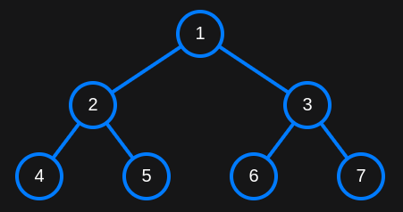
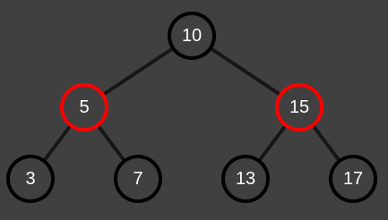

# Disptree
Note : Tested on Linux, gcc and g++

Repo link : https://github.com/Hruthik0x/disptree/

How to use ? 

**Note** : 
- RBNode, Node, createNode, dispTree are provided by dispTree lib.
- dispTree accepts both Node* and RBNode*

```C++
Node* root = createNode(1);
root->left = createNode(2);
root->right = createNode(3);
root->left->left = createNode(4);
root->left->right = createNode(5);
root->right->left = createNode(6);
root->right->right = createNode(7);

// Call this function to display the tree in browser
dispTree(root);
```

Output : 





```C++
RBNode* root = createRBNode(10);
root->color = BLACK; // Root must be black

root->left = createRBNode(5);
root->right = createRBNode(15);

root->left->left = createRBNode(3);
root->left->left->color = BLACK;

root->left->right = createRBNode(7);
root->left->right->color = BLACK;

root->right->left = createRBNode(13);
root->right->left->color = BLACK;

root->right->right = createRBNode(17);
root->right->right->color = BLACK;

// Call this function to display the tree in browser
dispTree(root);
```

Output : 



## Installation
 
```
git clone https://github.com/Hruthik0x/disptree/
sudo cp disptree/disptree.h /usr/local/include
```

Now you can use disptree, by using `#include <disptree.h>` 

Please refer to [test.c](./test.c) file 
